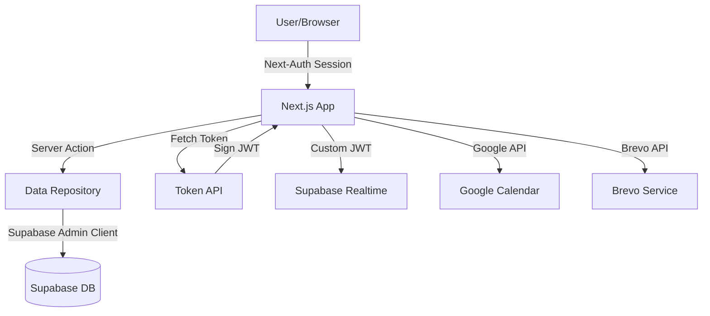
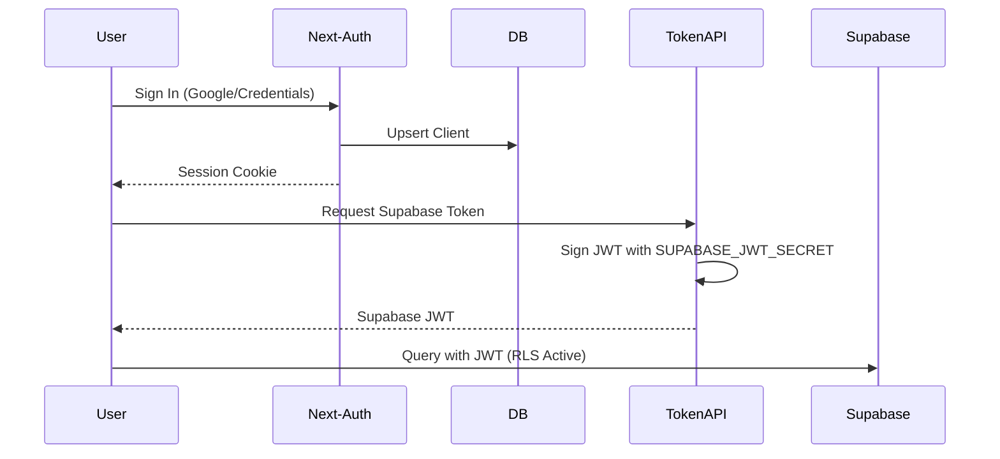

# Project State Report: Hylith

**Date:** June 1, 2026  
**Auditor:** Gemini CLI  
**Project:** Hylith Scheduling & Booking Platform

---

## Executive Summary

### What the Product Does
Hylith is a high-fidelity scheduling and discovery call platform. It allows potential clients to book "Discovery Meetings" with an agency based on admin-defined availability. It features a modern, visually rich landing page and a functional portal for both clients and administrators.

### Core Business Purpose
The primary purpose is to automate the lead intake and scheduling process. It integrates with Google Calendar to generate meeting links and uses transactional emails for notifications, ensuring a seamless experience for both the agency and its clients.

### Current Architecture
The application is built using **Next.js 16** (App Router) with a **Supabase** backend. It leverages **Auth.js (Next-Auth) v5** for authentication and uses a custom JWT flow to bridge Auth.js sessions with Supabase's Row Level Security (RLS). The frontend is highly optimized for performance and aesthetics, using **GSAP**, **Three.js**, and **Tailwind CSS 4**.

### Technical Maturity Assessment
**Advanced.** The project uses modern framework versions (Next.js 16, React 19), a clean repository pattern for data access, and sophisticated integration with external APIs (Google Calendar). The use of Realtime subscriptions for dashboard updates indicates a focus on low-latency user experience.

---

## Technology Stack

| Category | Technology | Purpose |
| :--- | :--- | :--- |
| **Framework** | Next.js 16.2.4 (App Router) | Core application framework (React 19). |
| **Database** | Supabase (PostgreSQL) | Primary data store, migrations, and RLS. |
| **Authentication** | Auth.js v5 (Next-Auth) | Session management, Google & Credentials providers. |
| **Styling** | Tailwind CSS 4 | Utility-first styling with modern features. |
| **Animations** | GSAP, Motion (Framer) | High-fidelity UI interactions and scroll animations. |
| **3D/Graphics** | Three.js, React Three Fiber | Interactive background and landing page visuals. |
| **State Management** | TanStack Query v5 | Client-side data fetching, caching, and synchronization. |
| **Integrations** | Google Calendar API | Meeting creation and Google Meet link generation. |
| **Email** | Brevo (SMTP/API) | Transactional email notifications. |
| **Realtime** | Supabase Realtime | Live updates for meeting statuses and availability. |

---

## Repository Structure

```text
D:\Projects\hylith\
├── app/                  # Next.js App Router (Routes, Layouts, Server Components)
│   ├── (auth)/           # Authentication routes (Login, Signup)
│   ├── (dashboard)/      # Client portal routes
│   ├── admin/            # Administrator portal
│   └── api/              # Backend API endpoints (Auth, Availability, Calendar)
├── components/           # React Components
│   ├── portal/           # Business-specific UI for Dashboard/Admin
│   ├── providers/        # Context Providers (Query, Realtime, Session)
│   └── ui/               # Reusable UI components (Shadcn-like)
├── lib/                  # Core Business Logic & Utilities
│   ├── data/             # Repository layer (Database access)
│   ├── supabase/         # Supabase client configurations and JWT logic
│   ├── email/            # Email service logic
│   └── seo/              # Metadata and JSON-LD configurations
├── public/               # Static assets (Logos, Fonts, Scripts)
├── supabase/             # Database migrations and RLS configuration
├── types/                # Global TypeScript definitions
└── utils/                # Helper functions and shared logic
```

---

## Environment Variables

| Name | Purpose | Used In | Sensitivity | Required |
| :--- | :--- | :--- | :--- | :--- |
| `AUTH_SECRET` | Next-Auth session encryption | `lib/auth.ts` | High | Yes |
| `GOOGLE_CLIENT_ID` | OAuth credentials for login | `lib/auth.ts` | Medium | Yes |
| `NEXT_PUBLIC_SUPABASE_URL` | Supabase project URL | `lib/supabase/config.ts` | Low | Yes |
| `SUPABASE_SERVICE_ROLE_KEY` | Admin database access | `lib/supabase/server.ts` | High | Yes |
| `SUPABASE_JWT_SECRET` | Signing custom RLS tokens | `lib/supabase/jwt.ts` | High | Yes |
| `BREVO_API_KEY` | Transactional email API | `lib/brevo.ts` | High | Yes |
| `CALENDAR_GOOGLE_REFRESH_TOKEN` | OAuth for Google Calendar | `lib/google-calendar.ts` | High | Yes |
| `AGENCY_TIMEZONE` | Default timezone for booking | `lib/availability.ts` | Low | Yes |

---

## Frontend Architecture

- **Routing**: Next.js App Router with logical grouping (`(auth)`, `(dashboard)`).
- **Layouts**: Hierarchical layouts for global, portal, and auth contexts.
- **Components**: Separated into atomic `ui` components and feature-driven `portal` components.
- **Data Fetching**: Server Components for initial load; TanStack Query for client-side interactivity and realtime updates.
- **State Management**: React Context via Providers (`DashboardDataProvider`, `RealtimeSyncProvider`).
- **Animations**: Heavy use of GSAP for landing page transitions and `motion` for UI feedback.

---

## Backend Architecture

- **Patterns**: Repository pattern in `lib/data/` decouples business logic from database schema.
- **Service Layer**: Dedicated logic for availability calculations (`lib/availability.ts`) and external integrations.
- **API Routes**: Used for specific client-side needs like fetching Supabase tokens or handling Google OAuth callbacks.
- **Server Actions**: Preferred for form submissions and state mutations.

---

## Authentication & Authorization

### Flow
1. **Frontend**: Next-Auth manages the session (JWT strategy).
2. **Bridge**: An API route (`/api/supabase/token`) issues a short-lived, HS256-signed JWT using the `SUPABASE_JWT_SECRET`.
3. **Supabase**: This token contains the `sub` (User ID) and `role` (Admin/User) claims, allowing Supabase RLS to enforce security.

### Roles
- `user`: Can view their own assignments and schedule new ones.
- `admin`: Can view all assignments, manage availability settings, and update statuses.

---

## Database Analysis (Supabase/Postgres)

### Tables
- `public.clients`: Mirrors Auth.js users.
- `public.assignments`: Core booking data (meeting time, status, project details).
- `public.settings`: Singleton table for global availability slots and duration.
- `public.logs`: Audit trail for system actions.
- `public.email_logs`: Tracking for sent notifications.

### Security
- **RLS**: Enabled on all tables. Policies use `is_admin()` and `jwt_sub()` functions to verify claims from the custom JWT.

---

## External Integrations

- **Google Calendar**: Used to create events and generate Google Meet links for confirmed discovery calls.
- **Brevo**: Handles all outgoing emails to both clients and agency admins.
- **Supabase**: Managed backend for DB, Realtime, and potential Storage usage.

---

## Security Review

### Strengths
- **Strict RLS**: Data access is controlled at the database level.
- **Manual JWT Signing**: Precise control over Supabase authentication without exposing service role keys to the frontend.
- **Server-Only Logic**: Sensitive integrations (Calendar, Email) are strictly server-side.

### Risks
- **Admin Identification**: Relies on email checking (`isAdminEmail`). While effective, it must be carefully maintained.
- **Secret Management**: Heavy reliance on environment variables; ensures these are not leaked in client bundles.

---

## Performance Review

### Observations
- **Realtime Efficiency**: `getSupabaseBrowserWithToken` caches clients to reduce handshake overhead.
- **Animation Overhead**: Three.js and GSAP are powerful but require careful monitoring of bundle size and main-thread performance on low-end devices.
- **Optimization**: Use of `turbopack` and Next.js 16 features for development and build performance.

---

## API Inventory

| Endpoint | Method | Purpose | Auth Required | Dependencies |
| :--- | :--- | :--- | :--- | :--- |
| `/api/auth/*` | GET/POST | Auth.js authentication flow | No | Next-Auth, Google OAuth |
| `/api/supabase/token` | GET | Issue custom JWT for Supabase RLS | Yes (Session) | `crypto`, `SUPABASE_JWT_SECRET` |
| `/api/availability` | GET | Fetch bookable slots for a date | No | `lib/availability.ts` |
| `/api/meetings` | POST | Create a new booking/assignment | Yes (User) | `lib/data/assignments.repository.ts` |
| `/api/admin/meetings` | GET/PATCH | Admin meeting management | Yes (Admin) | `lib/admin-server.ts` |
| `/api/calendar/callback` | GET | Google OAuth callback for calendar | No | `googleapis` |

---

## Business Logic Inventory

- **Availability Engine** (`lib/availability.ts`): Logic for generating, filtering, and validating time slots based on lead time and existing bookings.
- **Meeting Management** (`lib/data/assignments.repository.ts`): CRUD operations for meetings, including status transitions and conflict detection.
- **User Sync** (`lib/data/users.repository.ts`): Logic for bridging Auth.js profiles with the local `clients` table.
- **Realtime Sync** (`lib/sync/realtime-sync.ts`): Client-side handlers for Supabase Realtime event mapping to React Query.

---

## Technical Debt Review

- **JWT Implementation**: The manual signing of JWTs is a clever bridge but requires manual sync if Supabase's internal auth requirements change.
- **Repository Coupling**: While repositories exist, they are often called directly from components or actions without a formal "Service" layer for multi-step operations.
- **Environment Dependency**: The application is highly dependent on a large number of environment variables for core functionality.
- **Stale Data Handling**: The "heal stale session IDs" logic in `lib/auth.ts` suggests a recent migration from MongoDB; this code should eventually be deprecated once all users are migrated.

---

## NestJS Migration Readiness Assessment

### Move Immediately (Business Logic & Integrations)
- **Google Calendar Integration**: The OAuth flow and retry logic in `lib/google-calendar.ts` are prime candidates for a NestJS service.
- **Email Service**: Consolidating Brevo logic into a dedicated mail module.
- **Availability Engine**: Moving the complex slot calculation logic from `lib/availability.ts` to a structured NestJS service.

### Move Later (Data Access)
- **Repositories**: `lib/data/*.repository.ts` can be converted into NestJS Providers/Repositories using TypeORM or Prisma.
- **Audit Logging**: Centralizing logging logic.

### Keep As-Is (Frontend & Realtime)
- **Next.js App**: Keep the UI, layouts, and page-level data fetching in Next.js for SEO and performance.
- **Supabase RLS**: Continue using Supabase for the database layer to leverage its excellent RLS and Realtime features.

---

## Architecture Diagrams

### Current Data Flow


### Authentication Flow


---

## Final Assessment

| Category | Score | Explanation |
| :--- | :--- | :--- |
| **Architecture** | 9/10 | Excellent separation of concerns with repository patterns and a clever Auth-Supabase bridge. |
| **Scalability** | 8/10 | Next.js and Supabase scale well, but complex business logic is currently tightly coupled to the Next.js API/Actions. |
| **Security** | 9/10 | Strong RLS and manual JWT signing provide a robust security posture. |
| **Maintainability**| 8/10 | The repo is clean and well-structured, though the custom JWT logic adds some complexity for new developers. |

**Overall Conclusion:** A high-quality production-ready codebase with advanced patterns. Transitioning core business services to NestJS would further improve maintainability and testability for large-scale expansion.
